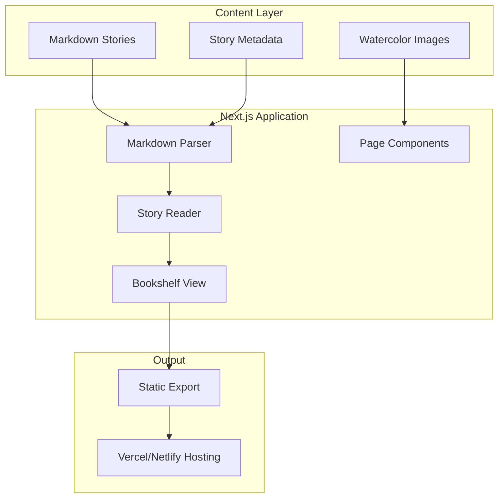

# Liam's Bookshelf - Development Plan

## Architecture Overview



## Tech Stack

- **Framework**: Next.js 14 with App Router (static export for easy hosting)
- **Styling**: Tailwind CSS with custom watercolor-inspired theme
- **Markdown**: gray-matter (frontmatter) + react-markdown
- **Animations**: Framer Motion for subtle page transitions
- **Fonts**: Classic serif for story text, playful accent font for titles

## Story Format with Image Mapping

Each story markdown file will use frontmatter to map images to pages:

```markdown
---
title: "Bubba's House"
author: "For Liam"
coverImage: "images/bubba house 1.png"
pages:
  - image: "images/bubba house 1.png"
  - image: "images/bubba house 2.png"
  - image: "images/bubba house 3.png"
  # ... etc
---

Liam's favorite place in the whole wide world was Bubba's house.

---

Not because of the playroom full of toys...
```

---

## Phase 1: Project Foundation ✅ COMPLETED

**Goal**: Set up the Next.js project with markdown parsing and story loading infrastructure.

**Tasks**:

1. ✅ Initialize Next.js project with TypeScript and Tailwind CSS
2. ✅ Create the story content structure and TypeScript types
3. ✅ Build the markdown parser with frontmatter support for image mapping
4. ✅ Create a story loader utility that reads from the `Stories/` folder
5. ✅ Set up the basic routing structure (`/` for bookshelf, `/story/[slug]` for reader)

**Testing checkpoint**: ✅ Stories load correctly and display as raw text with metadata.

**Implementation Notes**:
- Created manual Next.js setup (package.json, tsconfig, next.config, etc.) due to directory naming constraints
- Built flexible story parser that handles both frontmatter and markdown-only stories
- Auto-detects images from `images/` folder within each story directory
- Extracts titles from markdown `#` headers when frontmatter is absent
- Created TypeScript types: `Story`, `StoryPage`, `StoryMetadata`
- Implemented dynamic routing with `generateStaticParams` for static export
- Added build script to copy Stories folder to public directory for static serving

---

## Phase 2: Design System and Theme ✅ COMPLETED

**Goal**: Establish the nostalgic, watercolor aesthetic with a clean modern foundation.

**Design Direction**:

- **Color Palette**: Soft cream backgrounds (#FDF8F3), warm sepia tones, muted watercolor accents pulled from the illustrations (soft yellows, dusty pinks, sage greens)
- **Typography**: Elegant serif font (Crimson Pro or Libre Baskerville) for story text, a warm display font (Playfair Display) for titles
- **Textures**: Subtle paper grain overlay, soft drop shadows that mimic book pages
- **Aesthetic**: Think classic Winnie the Pooh storybook meets modern Apple design - warm but minimal

**Tasks**:

1. ✅ Configure Tailwind with custom color palette and typography scale
2. ✅ Create CSS variables for the watercolor theme
3. ✅ Build base UI components: Button, Card, Container
4. ✅ Add subtle paper texture backgrounds
5. ✅ Create app shell with consistent styling

**Testing checkpoint**: ✅ Components render with correct colors, fonts, and textures.

**Implementation Notes**:
- Extended Tailwind config with custom color system (cream, sepia, watercolor accents, text colors)
- Configured Google Fonts: Crimson Pro (serif) and Playfair Display (display)
- Created CSS custom properties for theme colors in `globals.css`
- Implemented paper texture using CSS radial gradients
- Built reusable components: `Button` (3 variants), `Card` (with hover effects), `Container` (responsive)
- Added book-shadow utility classes for 3D book effects
- Created app layout with consistent min-height and background styling
- Configured Next.js for conditional static export (dev vs production)

---

## Phase 3: Bookshelf (Home) Page ✅ COMPLETED

**Goal**: Create an inviting home page that displays all stories as books on a shelf.

**Design**:

- Header with "Liam's Bookshelf" title in a warm, hand-drawn style
- Stories displayed as book covers with slight 3D perspective
- Hover effects that lift the book slightly
- Mobile: Stack books in a cozy grid layout

**Tasks**:

1. ✅ Build the Bookshelf page layout
2. ✅ Create the BookCover component with cover image and title
3. ✅ Implement hover/tap animations
4. ✅ Add responsive grid for mobile/tablet/desktop
5. ✅ Style the header with decorative elements

**Testing checkpoint**: ✅ All stories appear on shelf, clicking navigates to story.

**Implementation Notes**:
- Created home page (`app/page.tsx`) with grid layout
- Stories display with cover images auto-detected from first image in images folder
- Implemented hover effects: scale, shadow transitions, color changes
- Grid responsive: 1 column (mobile), 2 (tablet), 3 (desktop)
- Card components show title, author (if present), and page count
- Links use Next.js `<Link>` for client-side navigation
- Cover images show as 3:4 aspect ratio with object-cover
- Added `BookshelfHeader` component with animated decorations (floating stars, animated title, decorative divider)
- Added `BookGrid` component with staggered Framer Motion animations for book cards
- Book cards lift on hover with smooth transitions

---

## Phase 4: Story Reader ✅ COMPLETED

**Goal**: Build the core reading experience with page-by-page navigation and image display.

**Design**:

- Clean, distraction-free reading mode
- Large image display (fills most of the viewport)
- Story text below or alongside the image
- Page navigation: swipe on mobile, arrow keys/buttons on desktop
- Progress indicator showing current page
- Subtle page-turn animation

**Tasks**:

1. ✅ Build the StoryReader page component
2. ✅ Parse story into pages (split on `---` dividers)
3. ✅ Create the PageView component (image + text)
4. ✅ Implement page navigation (prev/next buttons, keyboard, swipe)
5. ✅ Add page-turn transition animations
6. ✅ Build progress indicator (dots or page numbers)
7. ✅ Add "Back to Bookshelf" navigation

**Testing checkpoint**: ✅ Complete reading experience with page-by-page navigation.

**Implementation Notes**:
- Created `app/story/[slug]/page.tsx` with dynamic routing
- Story parser splits content on `\n---\n` pattern
- Pages auto-assigned images from available images in order
- Implemented ReactMarkdown for rendering markdown content (bold, italic, paragraphs)
- Added "Back to Bookshelf" button with ghost variant styling
- Created `StoryReader` client component with full navigation features:
  - Prev/Next arrow buttons
  - Keyboard navigation (Arrow Left/Right, Space to advance)
  - Swipe gestures via Framer Motion drag
  - Page progress indicator (dots for ≤10 pages, "X / Y" for more)
  - Smooth page-turn animations with AnimatePresence
  - Content fade-in animations for images and text

---

## Phase 5: Polish and Responsive Optimization ✅ COMPLETED

**Goal**: Ensure a delightful experience across all devices with finishing touches.

**Tasks**:

1. ✅ Fine-tune mobile layout (touch-friendly navigation, proper text sizing)
2. ✅ Add tablet-specific layout adjustments
3. ✅ Optimize images (Next.js Image component with proper sizing)
4. ✅ Add loading states with skeleton UI
5. ✅ Implement smooth scroll-to-top on page change
6. ✅ Add keyboard shortcuts (arrow keys, escape to exit)
7. Skipped: Reading mode toggle (not needed - current design is clean)

**Testing checkpoint**: ✅ Tested on mobile (375px), tablet (768px), and desktop (1200px).

**Implementation Notes**:
- Updated `StoryReader` with Next.js Image component, loading skeleton, scroll-to-top, and Escape key navigation
- Added responsive breakpoints (sm:, md:, lg:) throughout all components
- Improved touch targets with `touch-manipulation` CSS and larger tap areas on mobile
- Added image loading states with animated spinner skeleton
- Updated `BookGrid` with Next.js Image and loading skeleton for covers
- Enhanced `BookshelfHeader` with responsive sizing and optional decorative elements on mobile
- Updated `globals.css` with mobile-optimized utilities (smooth scroll, tap highlighting, line-clamp)
- Added proper viewport meta settings in `layout.tsx` with theme color
- All keyboard shortcuts working: Arrow keys (prev/next), Space (next), Escape (back to bookshelf)

---

## Phase 6: Deployment Preparation

**Goal**: Prepare for static hosting so family can access from anywhere.

**Tasks**:

1. Configure Next.js for static export (`output: 'export'`)
2. Ensure all images are properly bundled
3. Add a simple PWA manifest for mobile "Add to Home Screen"
4. Test the static build locally
5. Deploy to Vercel or Netlify
6. (Optional) Add a custom domain

**Testing checkpoint**: Site works when hosted, accessible from any device.

---

## File Structure (Current Implementation)

```
/app
  /page.tsx                 # ✅ Bookshelf home page (server component)
  /layout.tsx               # ✅ Root layout with metadata
  /globals.css              # ✅ Global styles with theme
  /story/[slug]/page.tsx    # ✅ Story reader with dynamic routing
  /components
    /Button.tsx             # ✅ Button component (3 variants)
    /Card.tsx               # ✅ Card component with hover effects
    /Container.tsx          # ✅ Responsive container
    /BookshelfHeader.tsx    # ✅ Animated header with decorative elements
    /BookGrid.tsx           # ✅ Book grid with staggered animations
    /StoryReader.tsx        # ✅ Page-by-page reader with navigation
  /lib
    /stories.ts             # ✅ Story loader utilities
    /types.ts               # ✅ TypeScript types
/Stories                    # Your existing content (unchanged)
  /bubbas house
    /bubbas house.md
    /images
  /grandpa always knows?!
    /grandpa.md
    /images
/public
  /Stories                  # ✅ Copied during build for static serving
  /.gitkeep
/scripts
  /copy-stories.js          # ✅ Build script to copy Stories to public
/package.json               # ✅ Dependencies and scripts
/tsconfig.json              # ✅ TypeScript configuration
/tailwind.config.ts         # ✅ Tailwind with custom theme
/next.config.js             # ✅ Next.js config (conditional static export)
/.gitignore                 # ✅ Standard Next.js ignores
```

---

## Key Design Principles

1. **Content First**: The illustrations and stories are the stars - UI should frame, not compete
2. **Warm and Inviting**: Every interaction should feel cozy and magical
3. **Effortless Navigation**: One tap/click to turn pages, obvious back button
4. **Works Everywhere**: Equally good experience on phone, tablet, and desktop

---

## Development Status

**Completed**: Phase 1, Phase 2, Phase 3, Phase 4, Phase 5
**Current State**: Fully polished app with responsive design, optimized images, and smooth interactions across all devices
**Dev Server**: `npm run dev` → http://localhost:3000
**Build**: `npm run build` → Creates static export in `/out`

**Next Steps**: 
- Deploy (Phase 6)